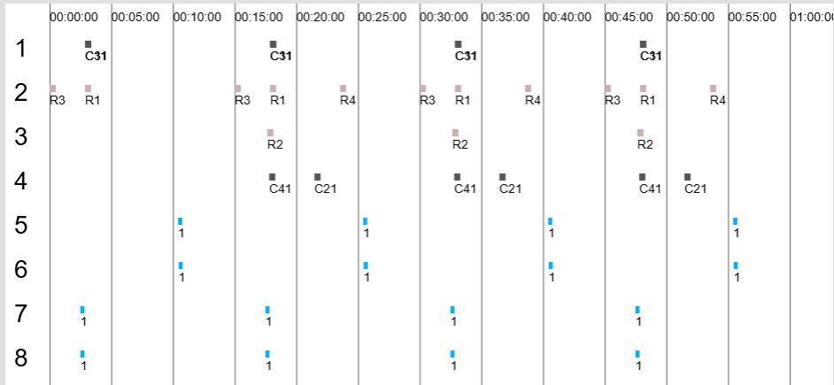

# Train schedule program for Minecraft MTR
This is a program to display the train schedule of Minecraft MTR with a different way from the internal server (localhost:8888 by default).

You can watch the Gantt chart of each station for each platform to help schedule your train. In the following figure, the occupancy of each platform in a specific station is displayed.

## Usage
Clone the whole project, open you Minecarft game, and then start `index.html` in your browser. Then you can grasp the train data.

If you have changed the default port of MTR mod, you must change the address in `script.js`.

Select the routes and stations in the sidebar. You can change the departure time for each route to eliminate platform conflicts.